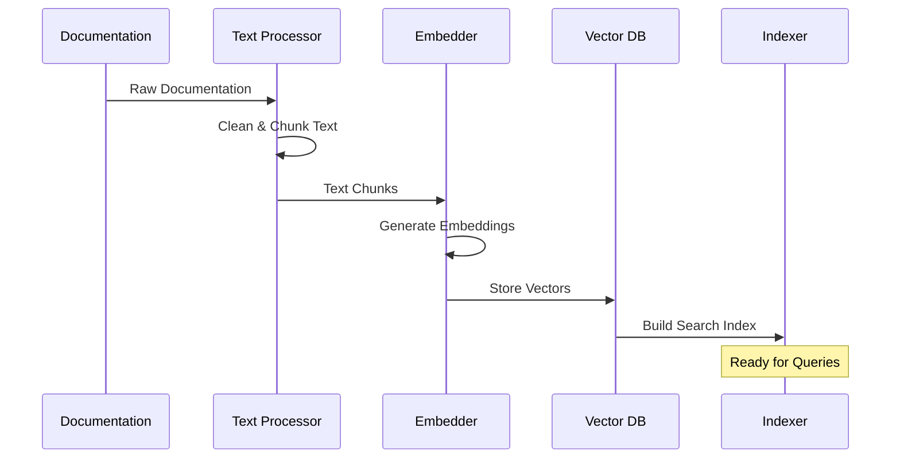
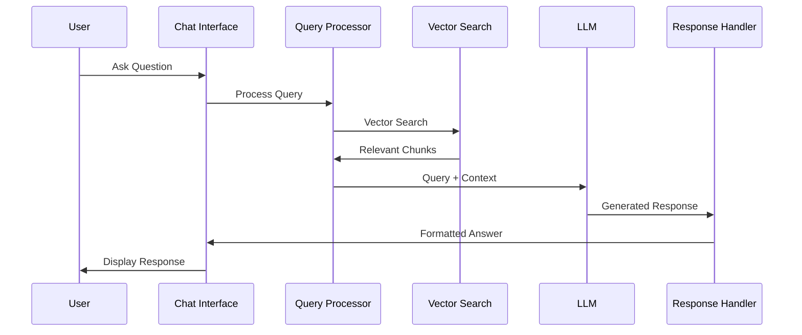

# 🤖 RAG Chatbot Specification
## Intelligent FAQ Assistant for Cold Caller Dashboard

---

## 📋 **Executive Summary**

This specification outlines the implementation of a **Retrieval-Augmented Generation (RAG) chatbot** that will provide intelligent FAQ assistance to users of the Cold Caller Dashboard. The chatbot will leverage the comprehensive documentation ecosystem within the application to provide contextually relevant answers about features, troubleshooting, and best practices.

---

## 🎯 **Project Overview**

### **Product Vision**
Create an intelligent, floating chatbot interface that allows users to quickly get answers about the Cold Caller Dashboard without leaving their workflow or hunting through documentation.

### **Key Objectives**
- **Reduce Support Tickets**: Provide instant answers to common questions
- **Improve User Experience**: Keep users in their workflow with contextual help
- **Increase Feature Adoption**: Help users discover and understand features
- **Accelerate Onboarding**: Guide new users through the platform

---

## 🏗️ **System Architecture**

### **High-Level Architecture**
```mermaid
graph TB
    subgraph "Frontend Layer"
        A[Floating Chat Icon] --> B[Chat Interface]
        B --> C[Message Handler]
        C --> D[Response Renderer]
    end
    
    subgraph "Backend Layer"
        E[Chat API] --> F[RAG Engine]
        F --> G[Vector Search]
        F --> H[LLM Integration]
        G --> I[Vector Database]
    end
    
    subgraph "Data Layer"
        J[Documentation Sources] --> K[Text Processor]
        K --> L[Embedding Generator]
        L --> I
    end
    
    C --> E
    D <-- H
    
    style A fill:#4CAF50
    style I fill:#2196F3
    style H fill:#FF9800
```

### **Technology Stack**
- **Frontend**: React 19.1.1, Tailwind CSS, Framer Motion (animations)
- **Backend**: Node.js, Express.js, Google Gemini API
- **Vector Database**: Supabase (pgvector extension)
- **Text Processing**: Langchain.js
- **Embeddings**: Google Gemini text-embedding-004

---

## 📚 **Documentation Sources Analysis**

Based on the codebase analysis, the following documentation sources will be indexed:

### **Primary Sources** (High Priority)
1. **README.md** - Main project overview and getting started
2. **START_GUIDE.md** - Quick startup instructions
3. **QUICK_TWILIO_START.md** - Twilio integration guide
4. **VOIP_ARCHITECTURE.md** - Technical architecture documentation
5. **docs/API_DOCUMENTATION_ENHANCED.md** - Complete API reference

### **Secondary Sources** (Medium Priority)
6. **TWILIO_SETUP_GUIDE.md** - Detailed Twilio setup
7. **TESTING_GUIDE.md** - Testing procedures
8. **DEPLOYMENT_README.md** - Deployment instructions
9. **SECURITY_AUDIT_REPORT.md** - Security information
10. **PERFORMANCE_OPTIMIZATION_REPORT.md** - Performance guidance

### **Tertiary Sources** (Lower Priority)
11. **Component Documentation** - In-code JSDoc comments
12. **API Endpoint Comments** - Backend route descriptions
13. **Configuration Files** - Package.json, environment examples
14. **Test Files** - Usage examples from test cases

### **Real-time Sources**
15. **Error Messages** - Common error patterns and solutions
16. **User Interactions** - Frequently accessed features
17. **Support Tickets** - Common user questions (future integration)

---

## 🎨 **User Interface Design**

### **Floating Chat Icon**
```typescript
interface FloatingChatIcon {
  position: {
    x: number;
    y: number;
    constraints: {
      minX: number;
      maxX: number;
      minY: number;
      maxY: number;
    };
  };
  state: 'collapsed' | 'minimized' | 'expanded';
  draggable: boolean;
  resizable: boolean;
  zIndex: 9999;
}
```

**Visual Specifications:**
- **Icon Size**: 60x60px (collapsed), 80x80px (hover)
- **Colors**: Primary blue (#3B82F6), hover (#2563EB)
- **Animation**: Subtle pulse for attention, smooth hover effects
- **Position**: Bottom-right corner by default, user-movable
- **Indicator**: Red dot for new features/updates

### **Chat Interface**
```typescript
interface ChatInterface {
  dimensions: {
    width: {
      min: 320;
      max: 480;
      default: 380;
    };
    height: {
      min: 400;
      max: 600;
      default: 500;
    };
  };
  components: [
    'Header',
    'MessageList',
    'QuickActions',
    'InputField',
    'StatusIndicator'
  ];
  animations: {
    open: 'slide-up-fade-in';
    close: 'slide-down-fade-out';
    message: 'fade-in-up';
  };
}
```

**Interface Components:**

1. **Header Bar**
   - Title: "ColdCaller Assistant"
   - Minimize/Close buttons
   - Drag handle for repositioning
   - Status indicator (online/offline)

2. **Message Area**
   - Scrollable message history
   - User messages (right-aligned, blue)
   - Bot responses (left-aligned, gray)
   - Typing indicators
   - Source citations for responses

3. **Quick Action Buttons**
   - "Getting Started"
   - "Twilio Setup Help"
   - "Troubleshooting"
   - "Feature Guide"

4. **Input Field**
   - Auto-expanding textarea
   - Send button
   - Character limit: 500
   - Placeholder: "Ask me anything about ColdCaller..."

---

## 🧠 **RAG System Architecture**

### **Document Processing Pipeline**


### **Query Processing Flow**


### **Vector Database Schema**
```typescript
interface DocumentChunk {
  id: string;
  content: string;
  embedding: number[];
  metadata: {
    source: string;
    title: string;
    section: string;
    lastUpdated: Date;
    relevanceScore: number;
    tags: string[];
  };
  searchable: {
    keywords: string[];
    topics: string[];
    intent: 'how-to' | 'troubleshooting' | 'reference' | 'explanation';
  };
}
```

---

## 🔧 **Implementation Plan**

### **Phase 1: Foundation (Week 1)**

#### **Backend Development**
- [ ] **Documentation Processor**
  ```javascript
  class DocumentationProcessor {
    async processMarkdownFiles(filePaths) {
      // Extract and clean text from markdown files
      // Split into semantic chunks (500-1000 characters)
      // Generate metadata and tags
      return processedChunks;
    }
  }
  ```

- [ ] **Vector Database Setup**
  ```javascript
  class VectorStore {
    async initialize() {
      // Setup Pinecone/Chroma connection
      // Create index with 1536 dimensions (OpenAI embeddings)
    }
    
    async addDocuments(chunks) {
      // Generate embeddings using OpenAI API
      // Store in vector database with metadata
    }
    
    async similaritySearch(query, k = 5) {
      // Convert query to embedding
      // Find most similar document chunks
      return relevantChunks;
    }
  }
  ```

- [ ] **RAG API Endpoints**
  ```javascript
  // POST /api/chat/query
  app.post('/api/chat/query', async (req, res) => {
    const { message, conversationId } = req.body;
    
    // 1. Process user query
    const processedQuery = await processQuery(message);
    
    // 2. Retrieve relevant context
    const context = await vectorStore.similaritySearch(processedQuery);
    
    // 3. Generate response with LLM
    const response = await generateResponse(processedQuery, context);
    
    // 4. Store conversation
    await storeConversation(conversationId, message, response);
    
    res.json({
      success: true,
      response: response.text,
      sources: response.sources,
      conversationId
    });
  });
  ```

#### **Frontend Development**
- [ ] **Floating Chat Component**
  ```javascript
  const FloatingChat = () => {
    const [isOpen, setIsOpen] = useState(false);
    const [position, setPosition] = useState({ x: 20, y: 20 });
    const [size, setSize] = useState({ width: 380, height: 500 });
    const [isDragging, setIsDragging] = useState(false);
    
    return (
      <div className="fixed z-[9999]" style={{ 
        right: position.x, 
        bottom: position.y 
      }}>
        <FloatingIcon onClick={() => setIsOpen(!isOpen)} />
        <AnimatePresence>
          {isOpen && (
            <motion.div
              initial={{ opacity: 0, scale: 0.8, y: 20 }}
              animate={{ opacity: 1, scale: 1, y: 0 }}
              exit={{ opacity: 0, scale: 0.8, y: 20 }}
              className="bg-white rounded-lg shadow-2xl border"
              style={{ width: size.width, height: size.height }}
            >
              <ChatHeader onClose={() => setIsOpen(false)} />
              <ChatMessages />
              <ChatInput />
            </motion.div>
          )}
        </AnimatePresence>
      </div>
    );
  };
  ```

### **Phase 2: Core Features (Week 2)**

- [ ] **Enhanced Query Processing**
  ```javascript
  class QueryProcessor {
    async processQuery(userMessage) {
      // Intent detection (question, help request, troubleshooting)
      const intent = await this.detectIntent(userMessage);
      
      // Entity extraction (feature names, error codes)
      const entities = await this.extractEntities(userMessage);
      
      // Query expansion with synonyms
      const expandedQuery = await this.expandQuery(userMessage);
      
      return {
        original: userMessage,
        intent,
        entities,
        expanded: expandedQuery,
        keywords: this.extractKeywords(userMessage)
      };
    }
  }
  ```

- [ ] **Response Generation**
  ```javascript
  class ResponseGenerator {
    async generateResponse(query, context) {
      const prompt = this.buildPrompt(query, context);
      
      const response = await openai.chat.completions.create({
        model: "gpt-4-turbo-preview",
        messages: [
          {
            role: "system",
            content: `You are a helpful assistant for the ColdCaller Dashboard. 
                     Use the provided context to answer questions accurately. 
                     If you cannot find the answer in the context, say so clearly.
                     Always cite your sources.`
          },
          {
            role: "user",
            content: prompt
          }
        ],
        temperature: 0.3,
        max_tokens: 500
      });
      
      return {
        text: response.choices[0].message.content,
        sources: this.extractSources(context),
        confidence: this.calculateConfidence(context, query)
      };
    }
  }
  ```

### **Phase 3: Advanced Features (Week 3)**

- [ ] **Conversation Memory**
- [ ] **Multi-turn Conversations**
- [ ] **User Feedback Collection**
- [ ] **Analytics and Insights**

---

## 📊 **API Specifications**

### **Chat API Endpoints**

#### **POST /api/chat/query**
Send a query to the RAG chatbot
```typescript
interface QueryRequest {
  message: string;
  conversationId?: string;
  userId?: string;
  context?: {
    currentPage: string;
    userRole: string;
  };
}

interface QueryResponse {
  success: boolean;
  response: string;
  sources: DocumentSource[];
  conversationId: string;
  confidence: number;
  suggestions?: string[];
}
```

#### **GET /api/chat/conversations/:id**
Retrieve conversation history
```typescript
interface ConversationResponse {
  id: string;
  messages: {
    role: 'user' | 'assistant';
    content: string;
    timestamp: Date;
    sources?: DocumentSource[];
  }[];
  createdAt: Date;
  lastActive: Date;
}
```

#### **POST /api/chat/feedback**
Submit feedback on chatbot responses
```typescript
interface FeedbackRequest {
  conversationId: string;
  messageId: string;
  rating: 1 | 2 | 3 | 4 | 5;
  feedback?: string;
}
```

---

## 🎛️ **Configuration & Settings**

### **Environment Variables**
```bash
# OpenAI Configuration
OPENAI_API_KEY=sk-...
OPENAI_MODEL=gpt-4-turbo-preview
OPENAI_EMBEDDING_MODEL=text-embedding-ada-002

# Vector Database
PINECONE_API_KEY=...
PINECONE_ENVIRONMENT=us-west1-gcp
PINECONE_INDEX_NAME=coldcaller-docs

# Chat Settings
CHAT_MAX_CONTEXT_LENGTH=4000
CHAT_MAX_RESPONSE_LENGTH=500
CHAT_SIMILARITY_THRESHOLD=0.7
CHAT_MAX_SOURCES=3
```

### **Frontend Configuration**
```typescript
interface ChatConfig {
  ui: {
    defaultPosition: { x: 20, y: 20 };
    minSize: { width: 320, height: 400 };
    maxSize: { width: 480, height: 600 };
    theme: 'light' | 'dark' | 'system';
  };
  behavior: {
    autoOpen: boolean;
    persistPosition: boolean;
    showTypingIndicator: boolean;
    enableSuggestions: boolean;
  };
  api: {
    baseUrl: string;
    timeout: number;
    retryAttempts: number;
  };
}
```

---

## 🔒 **Security Considerations**

### **Data Protection**
- **No PII Storage**: Conversations don't contain personal information
- **Rate Limiting**: 50 requests per minute per user
- **Input Sanitization**: Prevent injection attacks
- **Authentication**: Optional user context for personalized responses

### **API Security**
- **JWT Authentication**: Secure API endpoints
- **CORS Configuration**: Restrict origins
- **Request Validation**: Validate all inputs
- **Error Handling**: Don't expose system details

---

## 📈 **Analytics & Metrics**

### **Usage Metrics**
- **Query Volume**: Queries per day/hour
- **Response Time**: Average API response time
- **User Engagement**: Session duration, messages per session
- **Popular Topics**: Most asked questions
- **Success Rate**: Resolved vs escalated queries

### **Quality Metrics**
- **User Satisfaction**: Feedback ratings
- **Response Accuracy**: Manual evaluation
- **Source Relevance**: Relevance of retrieved documents
- **Conversation Completion**: Successful resolution rate

---

## 🧪 **Testing Strategy**

### **Unit Tests**
- Document processing functions
- Vector search accuracy
- Response generation logic
- UI component behavior

### **Integration Tests**
- End-to-end chat flow
- API endpoint functionality
- Database operations
- OpenAI API integration

### **User Acceptance Tests**
- Common user scenarios
- Edge cases and error handling
- Performance under load
- Cross-browser compatibility

---

## 🚀 **Deployment Plan**

### **Development Environment**
- Local vector database (Chroma)
- OpenAI API key for testing
- Hot reload for frontend changes
- Mock data for testing

### **Staging Environment**
- Pinecone staging index
- Full documentation set
- Performance testing
- User acceptance testing

### **Production Environment**
- Pinecone production index
- CDN for fast response times
- Monitoring and alerting
- Automatic scaling

---

## 📋 **Implementation Checklist**

### **Backend Tasks**
- [ ] Set up vector database (Pinecone/Chroma)
- [ ] Implement document processing pipeline
- [ ] Create RAG API endpoints
- [ ] Add conversation storage
- [ ] Implement rate limiting
- [ ] Add logging and monitoring
- [ ] Write comprehensive tests

### **Frontend Tasks**
- [ ] Create floating chat icon component
- [ ] Build expandable chat interface
- [ ] Implement drag and resize functionality
- [ ] Add smooth animations
- [ ] Create responsive design
- [ ] Add accessibility features
- [ ] Implement error handling

### **Content Tasks**
- [ ] Process all documentation files
- [ ] Generate embeddings for document chunks
- [ ] Create FAQ templates
- [ ] Test query accuracy
- [ ] Optimize response quality
- [ ] Add source citations

---

## 🔄 **Maintenance & Updates**

### **Regular Tasks**
- **Weekly**: Update documentation index
- **Monthly**: Review conversation logs for improvements
- **Quarterly**: Evaluate new LLM models
- **As Needed**: Add new documentation sources

### **Monitoring**
- API response times
- Error rates
- User satisfaction scores
- Query resolution rates
- System resource usage

---

## 💰 **Cost Estimation**

### **Monthly Operating Costs**
- **OpenAI API**: ~$50-100/month (based on usage)
- **Pinecone**: ~$70/month (starter plan)
- **Additional Storage**: ~$10/month
- **Total**: ~$130-180/month

### **Development Costs**
- **Initial Development**: 2-3 weeks (1 developer)
- **Documentation Processing**: 1 week
- **Testing & Refinement**: 1 week
- **Total Development Time**: 4-5 weeks

---

## 🎉 **Success Criteria**

### **Technical Success**
- [ ] < 2 second average response time
- [ ] > 95% uptime
- [ ] > 80% query resolution rate
- [ ] > 4.0/5 user satisfaction score

### **Business Success**
- [ ] 30% reduction in support tickets
- [ ] 50% improvement in feature discovery
- [ ] 25% faster user onboarding
- [ ] 90% user adoption rate

---

This specification provides a comprehensive roadmap for implementing an intelligent RAG chatbot that will significantly enhance the user experience of the Cold Caller Dashboard by providing instant, contextual assistance based on the rich documentation ecosystem already present in the application.