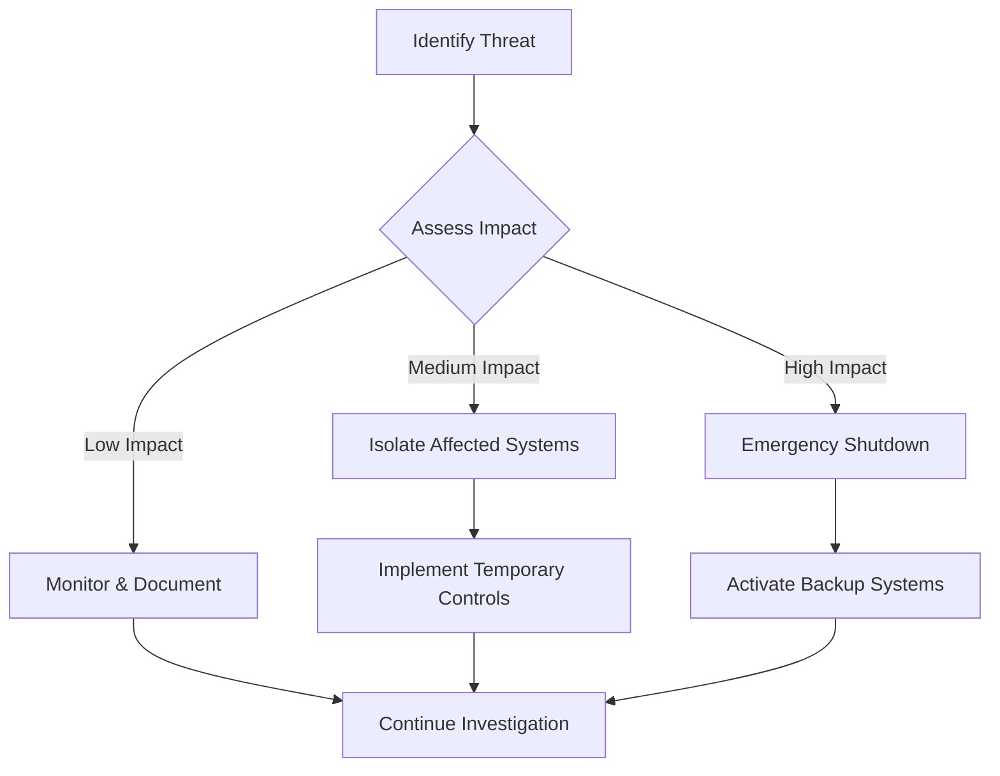

# 🚨 Security Incident Response Plan

## Overview

This document outlines the procedures for responding to security incidents in the ColdCaller application. All personnel should be familiar with these procedures to ensure rapid and effective response to security threats.

---

## 🎯 Incident Classification

### Severity Levels

| **Level** | **Description** | **Response Time** | **Escalation** |
|-----------|-----------------|-------------------|----------------|
| **P1 - Critical** | Active attack, data breach, system compromise | 15 minutes | Immediate C-level |
| **P2 - High** | Suspected breach, major vulnerability | 1 hour | Security team + Management |
| **P3 - Medium** | Security policy violation, minor vulnerability | 4 hours | Security team |
| **P4 - Low** | Security audit finding, informational | 24 hours | Security team |

### Incident Types

#### Authentication & Access Control
- **Unauthorized access** to systems or data
- **Privilege escalation** attempts or successes
- **Account takeover** incidents
- **Failed authentication** patterns indicating brute force
- **Suspicious login** patterns (unusual locations, times)

#### Data Security
- **Data exfiltration** or unauthorized data access
- **Data corruption** or unauthorized modification
- **Personal data breaches** (GDPR incidents)
- **Database compromise** or SQL injection attacks

#### Application Security
- **XSS attacks** or code injection attempts
- **API abuse** or unauthorized API access
- **File upload** security violations
- **Rate limiting** bypasses or DDoS attacks

#### Infrastructure Security
- **System compromise** or malware detection
- **Network intrusion** attempts
- **Service disruption** or availability issues
- **Configuration drift** from security baselines

---

## 📞 Incident Response Team

### Core Team

| **Role** | **Primary** | **Backup** | **Responsibilities** |
|----------|-------------|------------|---------------------|
| **Incident Commander** | Security Lead | CTO | Overall response coordination |
| **Security Analyst** | Security Engineer | Senior Developer | Technical investigation |
| **Communications Lead** | Product Manager | DevOps Lead | Internal/external communications |
| **Legal Counsel** | Legal Team | External Counsel | Compliance and legal guidance |

### Contact Information

```
🚨 EMERGENCY SECURITY HOTLINE: +1-XXX-XXX-XXXX
📧 Security Team: security@coldcaller.com
📱 Slack Channel: #security-incidents
🔗 Status Page: https://status.coldcaller.com
```

---

## 🔄 Incident Response Process

### Phase 1: Detection & Triage (0-15 minutes)

#### Immediate Actions
1. **Document the incident**
   - Timestamp of detection
   - How incident was discovered
   - Initial assessment of scope
   - Screenshot/log evidence

2. **Assess severity** using classification matrix
3. **Activate response team** based on severity
4. **Preserve evidence**
   - Take system snapshots
   - Preserve log files
   - Document system state

#### Detection Sources
- **Automated alerts** from monitoring systems
- **Audit log anomalies** from security scanning
- **User reports** of suspicious activity
- **External notifications** (customers, researchers, vendors)
- **Vulnerability scans** and security assessments

### Phase 2: Containment & Analysis (15 minutes - 2 hours)

#### Containment Strategy


#### Technical Analysis
1. **Log Analysis**
   ```bash
   # Check audit logs for suspicious activity
   grep -i "SECURITY_VIOLATION" /var/log/audit/*.log
   
   # Review authentication attempts
   grep -i "LOGIN_FAILED" /var/log/audit/*.log
   
   # Check for privilege escalation
   grep -i "AUTHORIZATION" /var/log/audit/*.log
   ```

2. **System Integrity Verification**
   ```bash
   # Check for unauthorized changes
   npm audit
   
   # Verify application integrity
   node -e "console.log(require('./src/utils/encryption').testEncryption())"
   
   # Database integrity check
   npm run db:check-integrity
   ```

3. **Network Analysis**
   - Review firewall logs
   - Analyze network traffic patterns
   - Check for unusual connections

### Phase 3: Eradication & Recovery (2-8 hours)

#### Eradication Steps
1. **Remove malicious elements**
   - Delete malicious files
   - Close unauthorized access
   - Patch vulnerabilities

2. **Strengthen security controls**
   - Update firewall rules
   - Enhance monitoring
   - Apply additional patches

3. **Verify system integrity**
   - Run security scans
   - Verify backup integrity
   - Test critical functions

#### Recovery Process
1. **Restore from clean backups** if necessary
2. **Apply security updates** and patches
3. **Implement additional monitoring**
4. **Gradually restore services** with enhanced monitoring
5. **Validate functionality** and security controls

### Phase 4: Post-Incident Activities (24-48 hours)

#### Documentation Requirements
1. **Incident Report** including:
   - Timeline of events
   - Root cause analysis
   - Impact assessment
   - Response actions taken
   - Lessons learned

2. **Evidence Preservation**
   - Forensic images
   - Log files
   - Communication records
   - Decision rationale

3. **Stakeholder Communication**
   - Internal debrief
   - Customer notifications
   - Regulatory reporting
   - Public disclosure (if required)

---

## 📋 Response Playbooks

### Playbook 1: Data Breach Response

#### Immediate Actions (0-15 minutes)
- [ ] Identify scope of potential data exposure
- [ ] Preserve evidence and system state
- [ ] Activate incident response team
- [ ] Begin containment procedures

#### Short-term Actions (15 minutes - 2 hours)
- [ ] Isolate affected systems
- [ ] Assess data types and sensitivity
- [ ] Determine number of affected individuals
- [ ] Begin forensic analysis
- [ ] Notify legal counsel

#### Medium-term Actions (2-24 hours)
- [ ] Complete impact assessment
- [ ] Prepare breach notifications
- [ ] Coordinate with law enforcement (if required)
- [ ] Implement remediation measures
- [ ] Begin customer communications

#### Long-term Actions (24+ hours)
- [ ] Submit regulatory notifications
- [ ] Monitor for fraud/misuse
- [ ] Conduct post-incident review
- [ ] Implement preventive measures
- [ ] Update security policies

### Playbook 2: System Compromise Response

#### Detection Indicators
- Unusual system behavior
- Unexpected network connections
- Modified system files
- Suspicious processes
- Performance anomalies

#### Response Steps
1. **Immediate Isolation**
   ```bash
   # Disconnect from network
   sudo iptables -A INPUT -j DROP
   sudo iptables -A OUTPUT -j DROP
   
   # Stop suspicious processes
   sudo systemctl stop suspicious-service
   
   # Preserve evidence
   sudo dd if=/dev/sda of=/mnt/evidence/disk-image.dd
   ```

2. **Analysis & Recovery**
   - Conduct forensic analysis
   - Rebuild systems from clean images
   - Implement enhanced monitoring
   - Restore from verified backups

### Playbook 3: DDoS Attack Response

#### Detection Signs
- Unusual traffic patterns
- Service degradation
- Resource exhaustion
- Failed requests spike

#### Response Actions
1. **Immediate Mitigation**
   - Activate DDoS protection
   - Implement rate limiting
   - Block malicious IPs
   - Scale infrastructure

2. **Analysis & Communication**
   - Identify attack vectors
   - Coordinate with ISP/CDN
   - Monitor service availability
   - Communicate with customers

---

## 🔐 Security Tools & Resources

### Incident Response Tools
```bash
# Emergency response toolkit
git clone https://github.com/coldcaller/incident-response-toolkit

# Security scanning
npm run security:scan

# Log analysis
tail -f /var/log/audit/security.log | grep -E "(CRITICAL|HIGH)"

# System health check
curl http://localhost:3001/api/health
```

### Forensic Utilities
- **System snapshots**: LVM/ZFS snapshots
- **Memory dumps**: gcore, volatility
- **Network analysis**: tcpdump, wireshark
- **Log analysis**: ELK stack, Splunk
- **File integrity**: AIDE, Tripwire

### Communication Templates

#### Internal Alert Template
```
🚨 SECURITY INCIDENT ALERT

Severity: [P1/P2/P3/P4]
Type: [Breach/Attack/Violation/Other]
Affected Systems: [List]
Discovery Time: [Timestamp]
Current Status: [Active/Contained/Resolved]

Immediate Actions Required:
- [ ] Action item 1
- [ ] Action item 2
- [ ] Action item 3

Incident Commander: [Name]
Next Update: [Time]
```

#### Customer Notification Template
```
Subject: Security Incident Notification

Dear [Customer],

We are writing to inform you of a security incident that may have affected your data in our ColdCaller system.

What Happened:
[Brief description of incident]

What Information Was Involved:
[Description of data types]

What We Are Doing:
[Remediation steps]

What You Can Do:
[Customer action items]

Contact Information:
security@coldcaller.com
+1-XXX-XXX-XXXX

We sincerely apologize for this incident and any inconvenience it may cause.
```

---

## 📊 Metrics & Reporting

### Key Performance Indicators
- **Mean Time to Detection (MTTD)**: Target < 15 minutes
- **Mean Time to Containment (MTTC)**: Target < 2 hours
- **Mean Time to Recovery (MTTR)**: Target < 8 hours
- **False Positive Rate**: Target < 5%

### Reporting Requirements

#### Internal Reporting
- **Executive summary** within 24 hours
- **Detailed report** within 72 hours
- **Lessons learned** within 1 week
- **Follow-up actions** within 30 days

#### External Reporting
- **GDPR breach notifications**: Within 72 hours to supervisory authority
- **Customer notifications**: Within legal timeframes
- **Regulatory reporting**: As required by jurisdiction
- **Law enforcement**: For criminal activity

---

## 🎓 Training & Preparedness

### Regular Activities
- **Monthly tabletop exercises**
- **Quarterly incident response drills**
- **Annual plan review and updates**
- **Continuous security awareness training**

### Simulation Scenarios
1. **Phishing campaign** resulting in credential compromise
2. **SQL injection** leading to data exfiltration
3. **Insider threat** with privileged access abuse
4. **Third-party breach** affecting integrated services
5. **Ransomware attack** on critical systems

---

## 📚 References & Resources

### Legal & Compliance
- GDPR breach notification requirements
- CCPA disclosure obligations
- SOX compliance considerations
- Industry-specific regulations

### Technical Resources
- NIST Cybersecurity Framework
- SANS Incident Response Guide
- OWASP Security Testing Guide
- CIS Critical Security Controls

### Emergency Contacts
- Local law enforcement: 911
- FBI Cyber Division: +1-855-292-3937
- CISA: +1-888-282-0870
- Cyber insurance provider: [Policy details]

---

**Document Version**: 1.0  
**Last Updated**: August 8, 2025  
**Next Review**: September 8, 2025  
**Owner**: Security Team  
**Approved By**: CISO