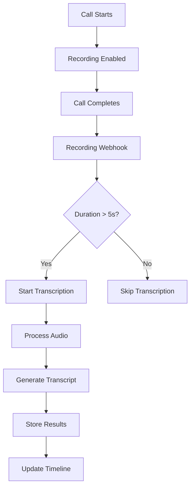

# 🎙️ Call Transcription Setup Guide - Complete Configuration

## 📋 Overview

This guide provides complete setup instructions for call transcription in your ColdCaller application:

- **For Testing**: Docker Whisper server (local, private, free)
- **For Production**: OpenAI Whisper API (cloud, reliable, paid)

## 🧪 Testing Setup (Docker Whisper)

### Prerequisites

- Docker installed and running
- Port 9000 available for Whisper server
- macOS/Linux/Windows with Docker Desktop

### Quick Setup

1. **Run the setup script:**
   ```bash
   chmod +x docker-whisper-setup.sh
   ./docker-whisper-setup.sh
   ```

2. **Verify installation:**
   ```bash
   ./test-whisper.sh
   ```

### Manual Setup (Alternative)

1. **Install Docker Whisper:**
   ```bash
   # Pull the Whisper server image
   docker pull onerahmet/openai-whisper-asr-webservice:latest
   
   # Run the server
   docker run -d \
     --name whisper-server \
     -p 9000:9000 \
     --restart unless-stopped \
     -e ASR_MODEL=base \
     -e ASR_ENGINE=openai_whisper \
     onerahmet/openai-whisper-asr-webservice:latest
   ```

2. **Update your `.env` file:**
   ```bash
   # Docker Whisper Configuration (for testing)
   WHISPER_API_URL=http://localhost:9000/asr
   WHISPER_API_KEY=
   WHISPER_MODEL=base
   
   # Enable transcription features
   ENABLE_CALL_RECORDING=true
   ENABLE_CALL_TRANSCRIPTION=true
   ENABLE_SPEECH_ANALYTICS=true
   DEFAULT_TRANSCRIPTION_PROVIDER=whisper
   DEFAULT_TRANSCRIPTION_LANGUAGE=en
   ```

3. **Restart your backend server:**
   ```bash
   cd backend && npm run dev
   ```

### Docker Commands

```bash
# Check server status
docker ps | grep whisper-server

# View server logs
docker logs whisper-server

# Stop server
docker stop whisper-server

# Start server
docker start whisper-server

# Remove server
docker stop whisper-server && docker rm whisper-server

# Test API endpoint
curl http://localhost:9000/docs
```

## 🚀 Production Setup (OpenAI Whisper API)

### Prerequisites

- OpenAI API account
- Valid OpenAI API key with billing enabled
- GoDaddy hosting or compatible web hosting

### Setup Steps

1. **Get OpenAI API Key:**
   - Go to: https://platform.openai.com/api-keys
   - Click "Create new secret key"
   - Name it "ColdCaller Transcription"
   - Copy the key (starts with `sk-...`)

2. **Update your `.env` file:**
   ```bash
   # Production OpenAI Whisper Configuration
   WHISPER_API_URL=https://api.openai.com/v1/audio/transcriptions
   WHISPER_API_KEY=sk-your-actual-openai-api-key-here
   WHISPER_MODEL=whisper-1
   
   # Enable transcription features
   ENABLE_CALL_RECORDING=true
   ENABLE_CALL_TRANSCRIPTION=true
   ENABLE_SPEECH_ANALYTICS=true
   DEFAULT_TRANSCRIPTION_PROVIDER=openai_whisper
   DEFAULT_TRANSCRIPTION_LANGUAGE=en
   ```

3. **Deploy to your hosting:**
   - Upload updated `.env` file to your server
   - Restart your application
   - Verify transcription is working

### Cost Estimation (OpenAI)

**Pricing**: $0.006 per minute of audio

**Example Costs**:
- 100 calls/day × 3 min average = 300 min/day
- Monthly: ~9,000 minutes = ~$54/month
- Heavy usage (500 calls/day): ~$270/month

## 🔄 Alternative Providers

Your system also supports these providers:

### Google Speech-to-Text
```bash
GOOGLE_SPEECH_API_KEY=your_google_speech_api_key
DEFAULT_TRANSCRIPTION_PROVIDER=google
```

### AWS Transcribe
```bash
AWS_ACCESS_KEY_ID=your_aws_access_key
AWS_SECRET_ACCESS_KEY=your_aws_secret_key
AWS_REGION=us-east-1
DEFAULT_TRANSCRIPTION_PROVIDER=aws
```

### Azure Speech Services
```bash
AZURE_SPEECH_KEY=your_azure_speech_key
AZURE_SPEECH_REGION=eastus
DEFAULT_TRANSCRIPTION_PROVIDER=azure
```

## ✅ How It Works

### Automatic Call Recording

1. **Call Initiation**: Recording enabled by default for all calls
2. **Twilio Integration**: Automatic recording via Twilio service
3. **Webhook Processing**: Recording completion triggers transcription
4. **Background Processing**: Transcription happens asynchronously

### Automatic Transcription Flow



### What Gets Stored

- **Call Recording URL**: Direct link to Twilio recording
- **Full Transcript**: Complete speech-to-text conversion
- **Speech Analytics**: Sentiment, talk ratio, emotion detection
- **Timeline Activity**: Logged to lead timeline automatically
- **Metadata**: Duration, confidence score, processing time

## 🧪 Testing Your Setup

### 1. Test Whisper Server (Docker)
```bash
curl http://localhost:9000/docs
```

### 2. Make a Test Call
1. Open your ColdCaller application
2. Make a test call to any number
3. Speak for more than 5 seconds
4. End the call

### 3. Check Logs
Look for these messages in your backend logs:
```
🎙️ Recording completed: callSid-xxx
🤖 Starting automatic transcription for call: callSid-xxx
✅ Transcription completed for call: callSid-xxx
```

### 4. Verify Timeline
- Open the lead details in your application
- Check the Timeline section
- Should show call activity with transcription

## 🔧 Troubleshooting

### Docker Whisper Issues

**Server won't start:**
```bash
# Check if port is in use
lsof -i :9000

# Check Docker logs
docker logs whisper-server

# Restart with fresh container
docker stop whisper-server && docker rm whisper-server
./docker-whisper-setup.sh
```

**Transcription not working:**
```bash
# Test API directly
curl -X POST "http://localhost:9000/asr" \
  -F "audio_file=@test.wav" \
  -F "task=transcribe" \
  -F "language=en"
```

### OpenAI API Issues

**Invalid API Key:**
- Verify key starts with `sk-`
- Check billing is enabled
- Test key with curl:
```bash
curl https://api.openai.com/v1/models \
  -H "Authorization: Bearer $WHISPER_API_KEY"
```

**Rate Limits:**
- OpenAI has rate limits
- Monitor usage in OpenAI dashboard
- Consider upgrading plan if needed

### General Issues

**No transcription logs:**
- Check `ENABLE_CALL_TRANSCRIPTION=true`
- Verify recording duration > 5 seconds
- Check Twilio webhook URLs are accessible

**Timeline not updating:**
- Verify `leadId` is passed in call requests
- Check leadTracking service is working
- Look for activity logging errors in logs

## 📈 Production Monitoring

### Key Metrics to Monitor

1. **Transcription Success Rate**: >95% expected
2. **Processing Time**: <30 seconds per minute of audio
3. **API Response Times**: <2 seconds for setup calls
4. **Error Rates**: <1% for critical operations
5. **Cost Tracking**: Monitor OpenAI usage and billing

### Recommended Alerts

- Transcription failures > 5% per hour
- API response times > 5 seconds
- OpenAI API key near rate limit
- Webhook failures > 3 per hour

## 🔐 Security Considerations

### Data Privacy
- Recordings stored securely with Twilio
- Transcripts encrypted in your database
- No permanent audio storage on your servers
- GDPR/compliance considerations for call recording

### API Security
- Store API keys as environment variables
- Never commit API keys to version control
- Use HTTPS for all API communications
- Regular API key rotation recommended

## 📞 Support

If you encounter issues:

1. **Check logs**: Backend server logs show detailed error messages
2. **Test components**: Use provided test scripts
3. **Verify configuration**: Double-check `.env` settings
4. **Monitor metrics**: Track success rates and response times

---

## 📋 Quick Reference

### Docker Commands
```bash
./docker-whisper-setup.sh  # Setup
./test-whisper.sh         # Test
docker logs whisper-server # Logs
```

### Environment Variables
```bash
# Testing (Docker)
WHISPER_API_URL=http://localhost:9000/asr
ENABLE_CALL_TRANSCRIPTION=true

# Production (OpenAI)
WHISPER_API_URL=https://api.openai.com/v1/audio/transcriptions
WHISPER_API_KEY=sk-your-key-here
```

### API Endpoints
- Docker Whisper: http://localhost:9000/docs
- OpenAI Whisper: https://api.openai.com/v1/audio/transcriptions
- Your Backend: http://localhost:3001/api/twilio/recording

---

**🎉 Setup Complete!** Your call transcription system is now ready for both testing and production deployment.