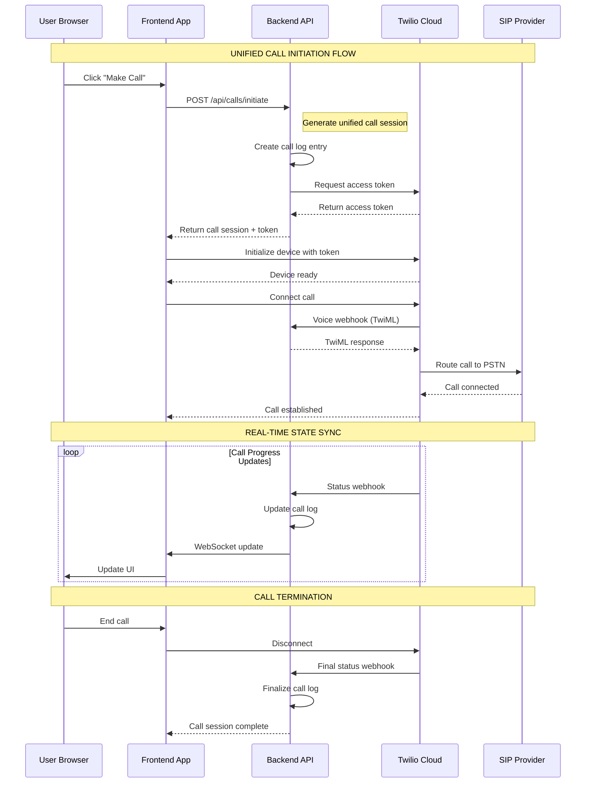

# 📞 Unified VOIP Architecture Design Document

## 🎯 Executive Summary

This document outlines the unified VOIP architecture that connects the frontend Twilio Voice SDK with backend call management systems, providing seamless call orchestration, state management, and webhook integration.

## 🏗️ Current Architecture Analysis

### Existing Components

#### Frontend (React)
- **TwilioVoiceManager.js**: Manages Twilio Voice SDK client-side operations
- **TwilioVoicePanel.js**: UI component for call controls and status display
- Handles: Access token management, device registration, call control UI

#### Backend (Node.js/Express)
- **TwilioService.js**: Server-side Twilio API wrapper and TwiML generation
- **twilioRoutes.js**: REST API endpoints for token generation, webhooks
- **callsController.js**: Advanced call logging with SIP integration
- Handles: Access tokens, call initiation, webhooks, logging, analytics

### 🔍 Architecture Gaps Identified

1. **Dual Call Systems**: Frontend uses Twilio SDK directly, backend has separate SIP integration
2. **State Sync Issues**: No real-time synchronization between frontend call state and backend logs
3. **Authentication Flow**: Token management distributed across components
4. **Webhook Routing**: TwiML webhooks don't properly route back to frontend clients
5. **Recording Coordination**: No unified recording strategy between systems

---

## 🚀 Unified VOIP Architecture

### 1. Call Flow Design



### 2. State Management Architecture

#### Unified Call State Model
```javascript
{
  // Unified Call Session
  callId: "uuid-v4",
  sessionId: "session-uuid",
  
  // Call Identification
  leadId: number | null,
  phoneNumber: string,
  direction: "inbound" | "outbound",
  
  // Frontend State (Twilio SDK)
  twilioCallSid: string | null,
  deviceStatus: "uninitialized" | "registered" | "ready" | "busy",
  callState: "idle" | "connecting" | "ringing" | "connected" | "disconnected",
  
  // Backend State (SIP/Logging)
  sipCallId: string | null,
  logStatus: "initiated" | "connected" | "ended" | "failed",
  
  // Real-time Sync
  lastSync: timestamp,
  syncStatus: "synchronized" | "pending" | "error",
  
  // Call Quality & Metrics
  quality: {
    latency: number,
    jitter: number,
    packetLoss: number,
    mos: number
  },
  
  // Recording State
  recording: {
    active: boolean,
    recordingId: string | null,
    format: "mp3" | "wav",
    duration: number
  }
}
```

### 3. Authentication Strategy

#### Token Management Flow
```typescript
interface AuthFlow {
  // JWT-based session management
  userSession: {
    userId: string,
    token: string,
    expires: Date
  },
  
  // Twilio-specific tokens
  twilioAccess: {
    accessToken: string,
    identity: string,
    expires: Date,
    capabilities: string[]
  },
  
  // Call session authorization
  callAuthorization: {
    sessionId: string,
    permissions: CallPermissions,
    leadAccess: boolean
  }
}

// Unified authentication middleware
const authenticateCall = async (req, res, next) => {
  // Validate JWT session
  // Generate Twilio access token
  // Create call session authorization
  // Attach to request context
}
```

### 4. Integration Patterns

#### A. Frontend Integration Pattern
```javascript
class UnifiedCallManager {
  constructor() {
    this.twilioManager = new TwilioVoiceManager();
    this.callSession = null;
    this.websocket = null;
  }
  
  async initiateCall(phoneNumber, leadId) {
    // 1. Request call session from backend
    const session = await this.requestCallSession(phoneNumber, leadId);
    
    // 2. Initialize Twilio with session token
    await this.twilioManager.initialize({
      accessToken: session.twilioToken,
      identity: session.identity
    });
    
    // 3. Establish WebSocket for real-time sync
    this.websocket = new WebSocket(`/ws/calls/${session.sessionId}`);
    this.websocket.onmessage = (event) => {
      this.handleBackendSync(JSON.parse(event.data));
    };
    
    // 4. Make the call
    const result = await this.twilioManager.makeCall(phoneNumber);
    
    // 5. Sync initial call state
    await this.syncCallState('initiated', result);
    
    return result;
  }
  
  async syncCallState(event, data) {
    // Send state updates to backend
    await fetch(`/api/calls/${this.callSession.id}/sync`, {
      method: 'POST',
      body: JSON.stringify({ event, data, timestamp: Date.now() })
    });
  }
}
```

#### B. Backend Integration Pattern
```javascript
class UnifiedCallController {
  async initiateCall(req, res) {
    const { phoneNumber, leadId } = req.body;
    const userId = req.user.id;
    
    try {
      // 1. Create unified call session
      const session = await this.createCallSession({
        userId,
        phoneNumber,
        leadId,
        sessionId: uuidv4()
      });
      
      // 2. Generate Twilio access token
      const twilioToken = TwilioService.generateAccessToken(
        `user-${userId}-${session.sessionId}`
      );
      
      // 3. Initialize call log
      const callLog = await this.createInitialCallLog(session);
      
      // 4. Setup webhook context
      await this.setupWebhookContext(session);
      
      return res.json({
        success: true,
        session: {
          sessionId: session.sessionId,
          callId: callLog.id,
          twilioToken: twilioToken.accessToken,
          identity: twilioToken.identity,
          webhookUrl: `${process.env.BASE_URL}/api/twilio/voice?session=${session.sessionId}`
        }
      });
    } catch (error) {
      return ResponseFormatter.error(res, error.message);
    }
  }
  
  async handleTwilioVoiceWebhook(req, res) {
    const { sessionId } = req.query;
    const { CallSid, From, To, Direction } = req.body;
    
    try {
      // 1. Retrieve call session context
      const session = await this.getCallSession(sessionId);
      
      // 2. Update call log
      await this.updateCallLog(session.callId, {
        twilioCallSid: CallSid,
        status: 'connecting'
      });
      
      // 3. Generate context-aware TwiML
      const twiml = this.generateContextualTwiML(session, req.body);
      
      // 4. Send real-time update via WebSocket
      this.broadcastCallUpdate(sessionId, {
        event: 'webhook_received',
        data: req.body
      });
      
      res.type('text/xml');
      res.send(twiml);
    } catch (error) {
      console.error('Webhook error:', error);
      res.type('text/xml');
      res.send(this.generateErrorTwiML());
    }
  }
}
```

### 5. Webhook Configuration

#### TwiML Webhook Routing Strategy
```javascript
const generateContextualTwiML = (session, webhookData) => {
  const actions = [];
  
  // Route based on call direction and session context
  if (webhookData.Direction === 'outbound') {
    // Outbound call - connect to destination
    actions.push({
      type: 'say',
      text: 'Connecting your call...',
      options: { voice: 'alice' }
    });
    
    actions.push({
      type: 'dial',
      number: session.phoneNumber,
      options: {
        timeout: 30,
        record: session.recordingEnabled ? 'record-from-answer' : false,
        callerId: process.env.CALLER_ID
      }
    });
  } else {
    // Inbound call - route to frontend client
    actions.push({
      type: 'dial',
      client: session.identity,
      options: {
        timeout: 20,
        record: 'record-from-ringing'
      }
    });
  }
  
  return TwilioService.generateTwiML(actions);
};

// Webhook endpoint configuration
const webhookEndpoints = {
  voice: '/api/twilio/voice',        // Call initiation/routing
  status: '/api/twilio/status',      // Call status updates
  recording: '/api/twilio/recording' // Recording completion
};

// Dynamic webhook URLs with session context
const getWebhookUrls = (sessionId, baseUrl) => ({
  voice: `${baseUrl}/api/twilio/voice?session=${sessionId}`,
  status: `${baseUrl}/api/twilio/status?session=${sessionId}`,
  recording: `${baseUrl}/api/twilio/recording?session=${sessionId}`
});
```

---

## 🔧 Implementation Guidelines

### Phase 1: Core Integration (Week 1)
1. **Unified Call Session Management**
   - Create CallSessionManager class
   - Implement session-based authentication
   - Setup WebSocket infrastructure

2. **Frontend Integration**
   - Modify TwilioVoiceManager for session-based flow
   - Add WebSocket state synchronization
   - Update TwilioVoicePanel for unified status display

### Phase 2: Webhook Enhancement (Week 2)
1. **Context-Aware Webhooks**
   - Implement session-based webhook routing
   - Add dynamic TwiML generation
   - Setup proper error handling

2. **State Synchronization**
   - Real-time call state updates
   - Bi-directional sync between frontend/backend
   - Conflict resolution strategies

### Phase 3: Advanced Features (Week 3)
1. **Recording Coordination**
   - Unified recording start/stop
   - Recording metadata management
   - File storage and retrieval

2. **Analytics Integration**
   - Real-time call metrics
   - Quality monitoring
   - Performance analytics

---

## 🛡️ Security Considerations

### Access Token Security
- Short-lived access tokens (1 hour max)
- Token rotation on session refresh
- Scope-limited permissions per call session

### Webhook Validation
- Twilio signature validation on all webhooks
- Session-based request validation
- Rate limiting and DDoS protection

### Data Protection
- Call logs encrypted at rest
- Recording files secured with access controls
- PII data handling compliance

---

## 📊 Monitoring & Observability

### Call Quality Metrics
- Real-time MOS (Mean Opinion Score) tracking
- Latency, jitter, packet loss monitoring
- Connection success rate analytics

### System Health
- SIP registration status monitoring
- Twilio service availability checks
- WebSocket connection health

### Business Metrics
- Call success rates by lead type
- Conversion tracking
- Agent performance analytics

---

## 🔄 Migration Strategy

### Current State → Unified Architecture
1. **Maintain Backward Compatibility**
   - Keep existing endpoints functional
   - Gradual migration of call flows
   - Parallel system operation during transition

2. **Data Migration**
   - Merge existing call logs with new schema
   - Preserve recording file associations
   - Maintain lead interaction history

3. **Testing Strategy**
   - A/B testing of unified vs legacy flows
   - Load testing of WebSocket connections
   - End-to-end call flow validation

---

## 📚 API Reference

### Core Endpoints

#### `POST /api/calls/initiate`
Initialize unified call session
```json
{
  "phoneNumber": "+1234567890",
  "leadId": 123,
  "recordingEnabled": true
}
```

#### `POST /api/calls/{sessionId}/sync`
Synchronize call state
```json
{
  "event": "connected",
  "data": { "twilioCallSid": "CA123..." },
  "timestamp": 1642534800000
}
```

#### `WS /ws/calls/{sessionId}`
Real-time call updates via WebSocket
```json
{
  "type": "state_change",
  "callId": "uuid",
  "state": "connected",
  "quality": { "mos": 4.2, "latency": 45 }
}
```

---

## 🎉 Expected Benefits

### For Users
- Seamless call experience with real-time status updates
- Unified call history and recording access
- Improved call quality monitoring

### For Developers
- Single source of truth for call state
- Simplified debugging and monitoring
- Consistent API for call operations

### For Business
- Comprehensive call analytics
- Improved conversion tracking
- Scalable architecture for growth

---

This unified architecture provides the foundation for a robust, scalable VOIP system that seamlessly integrates frontend user experience with backend call management capabilities.